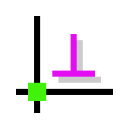

以下是基于原README内容的中文翻译版本：

```markdown:d:\github\solvespace\my_docs\readme_zh.md
# SolveSpace



[](https://github.com/solvespace/solvespace/actions)
[](https://snapcraft.io/solvespace)
[](https://snapcraft.io/solvespace)

本仓库包含[SolveSpace][]的源代码，这是一个参数化的2D/3D CAD工具。

[solvespace]: https://solvespace.com

## 社区

官方SolveSpace[网站][sswebsite]提供[教程][sstutorial]、[参考手册][ssref]和[论坛][ssforum]；还有一个官方IRC频道[#solvespace at web.libera.chat][ssirc]。

[sswebsite]: http://solvespace.com/
[ssref]: http://solvespace.com/ref.pl
[sstutorial]: http://solvespace.com/tutorial.pl
[ssforum]: http://solvespace.com/forum.pl
[ssirc]: https://web.libera.chat/#solvespace

## 安装

### 通过官方包

macOS(>=10.6 64位)和Windows(>=Vista 32位)的官方发布包可通过[GitHub releases][rel]获取。这些包由SolveSpace维护者为每个稳定版本自动构建。

[rel]: https://github.com/solvespace/solvespace/releases

### 通过Flathub

官方版本可作为Flatpak从Flathub安装。

[从Flathub获取SolveSpace](https://flathub.org/apps/details/com.solvespace.SolveSpace)

这适用于任何支持Flatpak的Linux发行版。

### 通过Snap Store

官方版本可从`stable`渠道安装。

主分支的构建会自动发布到Snap Store的`edge`渠道。这些包包含最新的改进，但测试不如发布版本充分。

[](https://snapcraft.io/solvespace)

或从终端安装：

```sh
# 获取最新的稳定版本：
snap install solvespace

# 获取主分支的最新开发版本：
snap install solvespace --edge
```

### 通过自动化边缘构建

> :warning: **边缘构建可能不稳定或包含严重错误！**
> 它们旨在供有经验的用户测试新功能或验证错误修复。

最新主分支提交的前沿构建可从以下链接获取zip存档：

- [macOS](https://nightly.link/solvespace/solvespace/workflows/cd/master/macos.zip)
- [Windows](https://nightly.link/solvespace/solvespace/workflows/cd/master/windows.zip)
- [启用OpenMP的Windows版本](https://nightly.link/solvespace/solvespace/workflows/cd/master/windows-openmp.zip)

解压下载的存档并安装或执行其中的文件，具体取决于您的平台。

### 通过源代码

无论使用何种操作系统，在构建前请检出项目及必要的子模块：

```sh
git clone https://github.com/solvespace/solvespace
cd solvespace
git submodule update --init
```

您需要安装`git`。请参阅下面的平台特定说明进行安装。

## 在Linux上构建

### 为Linux构建

您需要常规构建工具、CMake、zlib、libpng、cairo、freetype。要构建GUI，您需要fontconfig、gtkmm 3.0(3.16或更高版本)、pangomm 1.4、OpenGL和OpenGL GLU，以及可选的Space Navigator客户端库。在Debian衍生版(如Ubuntu)上，可通过以下命令安装：

```sh
sudo apt install git build-essential cmake zlib1g-dev libpng-dev \
            libcairo2-dev libfreetype6-dev libjson-c-dev \
            libfontconfig1-dev libgtkmm-3.0-dev libpangomm-1.4-dev \
            libgl-dev libglu-dev libspnav-dev
```

在RedHat衍生版(如Fedora)上，可通过以下命令安装依赖项：

```sh
sudo dnf install git gcc-c++ cmake zlib-devel libpng-devel \
            cairo-devel freetype-devel json-c-devel \
            fontconfig-devel gtkmm30-devel pangomm-devel \
            mesa-libGL-devel mesa-libGLU-devel libspnav-devel
```

构建前，请[检出项目及必要的子模块](#通过源代码)。

然后按以下方式构建SolveSpace：

```sh
mkdir build
cd build
cmake .. -DCMAKE_BUILD_TYPE=Release -DENABLE_OPENMP=ON
make

# 可选
sudo make install
```

链接时优化(LTO)支持可通过在cmake中添加`-DENABLE_LTO=ON`启用，但会增加构建时间。

图形界面构建为`build/bin/solvespace`，命令行界面构建为`build/bin/solvespace-cli`。可通过向cmake传递`-DENABLE_GUI=OFF`标志仅构建命令行界面。

### 为Windows构建

Ubuntu需要20.04或更高版本。使用WSL进行交叉编译也确认可行。

您需要常规构建工具、CMake和Windows交叉编译器。在Debian衍生版(如Ubuntu)上，可通过以下命令安装：

```sh
apt-get install git build-essential cmake mingw-w64
```

构建前，请[检出项目及必要的子模块](#通过源代码)。

按以下方式构建64位SolveSpace：

```sh
mkdir build
cd build
cmake .. -DCMAKE_TOOLCHAIN_FILE=../cmake/Toolchain-mingw64.cmake \
            -DCMAKE_BUILD_TYPE=Release
make
```

图形界面构建为`build/bin/solvespace.exe`，命令行界面构建为`build/bin/solvespace-cli.exe`。

不支持Space Navigator。

### 为Web构建(非常实验性)

**请注意此端口包含许多关键错误和未实现的核心功能。**

您需要常规构建工具、cmake和[Emscripten][]。在Debian衍生版(如Ubuntu)上，除Emscripten外的依赖项可通过以下命令安装：

```sh
apt-get install git build-essential cmake
```

首先，安装并准备`emsdk`：

```sh
git clone https://github.com/emscripten-core/emsdk
cd emsdk
./emsdk install latest
./emsdk activate latest
source ./emsdk_env.sh
cd ..
```

构建前，请[检出项目及必要的子模块](#通过源代码)。

然后按以下方式构建SolveSpace：

```sh
mkdir build
cd build
emcmake cmake .. -DCMAKE_BUILD_TYPE=Release -DENABLE_LTO="ON" -DENABLE_TESTS="OFF" -DENABLE_CLI="OFF" -DENABLE_COVERAGE="OFF"
make
```

图形界面构建为`build/bin`目录中多个以`solvespace`开头的文件。可通过`emrun build/bin/solvespace.html`本地运行。

不支持命令行界面。

[emscripten]: https://emscripten.org/

## 在macOS上构建

您需要git、XCode工具、CMake和libomp。Git、CMake和libomp可通过[Homebrew][]安装：

```sh
brew install git cmake libomp
```

XCode必须通过AppStore或[Apple网站][appledeveloper]安装；需要免费的Apple ID。

构建前，请[检出项目及必要的子模块](#通过源代码)。

然后按以下方式构建SolveSpace：

```sh
mkdir build
cd build
cmake .. -DCMAKE_BUILD_TYPE=Release -DENABLE_OPENMP=ON
make
```

链接时优化(LTO)支持可通过在cmake中添加`-DENABLE_LTO=ON`启用，但会增加构建时间。

或者，生成XCode项目，打开它并构建"Release"方案：

```sh
mkdir build
cd build
cmake .. -G Xcode
```

应用程序构建为`build/bin/SolveSpace.app`，图形界面可执行文件为`build/bin/SolveSpace.app/Contents/MacOS/SolveSpace`，命令行界面可执行文件为`build/bin/SolveSpace.app/Contents/MacOS/solvespace-cli`。

[homebrew]: https://brew.sh/
[appledeveloper]: https://developer.apple.com/download/

## 在OpenBSD上构建

您需要git、cmake、libexecinfo、libpng、gtk3mm和pangomm。这些可从ports树安装：

```sh
pkg_add -U git cmake libexecinfo png json-c gtk3mm pangomm
```

构建前，请[检出项目及必要的子模块](#通过源代码)。

然后按以下方式构建SolveSpace：

```sh
mkdir build
cd build
cmake .. -DCMAKE_BUILD_TYPE=Release
make
sudo make install
```

不幸的是，在OpenBSD上，生成的可执行文件不是文件系统位置独立的，必须安装后才能使用。默认情况下，图形界面安装到`/usr/local/bin/solvespace`，命令行界面构建为`/usr/local/bin/solvespace-cli`。可通过向cmake传递`-DENABLE_GUI=OFF`标志仅构建命令行界面。

## 在Windows上构建

您需要[git][gitwin]、[cmake][cmakewin]和C++编译器(Visual C++或MinGW)。如果使用Visual C++，需要Visual Studio 2015或更高版本。如果gawk在您的路径中，请确保它是能处理CL LF行尾的适当Windows端口。否则CMake可能会因为libpng中的一些awk脚本而失败-问题#1228。

构建前，请[检出项目及必要的子模块](#通过源代码)。

### 使用Visual Studio IDE构建

在源代码树中创建`build`目录，并将cmake-gui指向源代码树和该目录。点击"Configure"和"Generate"，然后用Visual C++打开`build\solvespace.sln`并构建它。

### 在命令提示符中使用Visual Studio构建

首先，确保`git`和`cl`(Visual C++编译器驱动程序)在您的`%PATH%`中；后者通常通过从Visual Studio安装中调用`vcvarsall.bat`完成。然后，在cmd或PowerShell中运行以下命令：

```bat
mkdir build
cd build
cmake .. -G "NMake Makefiles" -DCMAKE_BUILD_TYPE=Release
nmake
```

### 使用MinGW构建

也可以使用[MinGW][mingw]构建SolveSpace，但不支持Space Navigator。

首先，确保git和gcc在您的`$PATH`中。然后，在bash中运行以下命令：

```sh
mkdir build
cd build
cmake .. -DCMAKE_BUILD_TYPE=Release
make
```

[gitwin]: https://git-scm.com/download/win
[cmakewin]: http://www.cmake.org/download/#latest
[mingw]: http://www.mingw.org/

## 贡献

请参阅[贡献者指南](CONTRIBUTING.md)了解提交问题、贡献代码和调试SolveSpace的最佳方式。

## 许可证

SolveSpace根据[GPL v3](COPYING.txt)或更高版本的条款分发。
